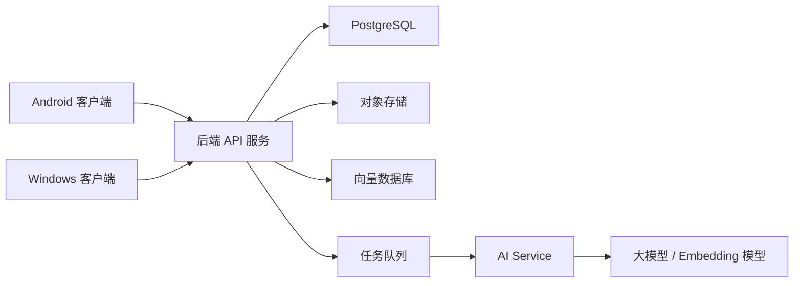
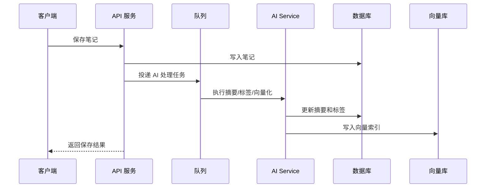

# FloAssistant 项目文档

## 1. 项目概述

FloAssistant 是一款面向 Windows 和 Android 的跨端智能记事本应用。应用支持文字、图片、视频等多媒体内容记录，并接入 AI 能力，帮助用户完成内容整理、摘要、搜索、问答、标签生成和知识回顾。

项目目标不是只做一个普通便签工具，而是构建一个“可沉淀、可检索、可理解”的个人记录系统。用户可以随时记录灵感、会议纪要、学习笔记、图片素材、视频片段，并通过 AI 快速提炼价值。

## 2. 产品目标

### 2.1 核心目标

- 支持 Windows 和 Android 两端登录、记录、同步和管理笔记。
- 支持文字、图片、视频混合内容的创建、编辑、预览和归档。
- 接入 AI，提供摘要、标签、语义搜索、问答、改写和内容整理能力。
- 保证数据同步稳定、离线可用、隐私可控。
- 为后续扩展语音输入、OCR、视频理解、浏览器剪藏等能力预留架构空间。

### 2.2 目标用户

- 需要跨设备记录灵感、待办、资料和备忘的个人用户。
- 学生、创作者、开发者、研究人员等高频笔记用户。
- 需要用 AI 整理信息、快速检索历史内容的知识工作者。

## 3. 应用范围

### 3.1 首期范围

- Windows 客户端。
- Android 客户端。
- 用户账号系统。
- 笔记创建、编辑、删除、收藏、归档。
- 支持文字、图片、视频附件。
- 云端同步。
- AI 摘要、AI 标签、AI 搜索、AI 问答。
- 基础设置页，包括账号、同步、AI、存储和隐私设置。

### 3.2 暂不纳入首期

- 多人协作编辑。
- 公开分享社区。
- 复杂知识图谱可视化。
- 实时音视频会议记录。
- 企业级权限管理。

## 4. 核心功能设计

### 4.1 笔记管理

用户可以创建多种形式的笔记：

- 纯文字笔记。
- 图文混排笔记。
- 包含视频附件的笔记。
- 快速备忘。
- 草稿笔记。

笔记应支持：

- 标题自动生成或手动编辑。
- 富文本基础编辑，如加粗、列表、引用、代码块。
- 图片插入、预览、删除。
- 视频插入、播放、封面生成。
- 标签管理。
- 收藏。
- 归档。
- 回收站。
- 按时间、标签、关键词、内容类型筛选。

### 4.2 多媒体能力

#### 图片

- 支持从本地选择图片。
- 支持 Android 拍照上传。
- 支持 Windows 粘贴截图。
- 支持图片压缩和缩略图生成。
- 支持图片 OCR 预留接口。

#### 视频

- 支持本地选择视频。
- 支持 Android 拍摄视频上传。
- 支持基础播放。
- 支持视频封面生成。
- 支持视频大小限制和压缩策略。
- 为后续 AI 视频摘要、关键帧提取预留能力。

### 4.3 AI 功能

首期 AI 能力建议包括：

- 自动摘要：根据笔记内容生成简短摘要。
- 自动标签：根据内容生成 3 到 8 个标签。
- 智能标题：根据正文自动生成标题。
- 内容改写：将笔记改写为更清晰、正式、简洁或条理化的版本。
- 语义搜索：用户可以用自然语言搜索历史笔记。
- 笔记问答：用户可以针对某篇笔记或全部笔记提问。
- 待办提取：从笔记中识别任务项。

后续可扩展：

- OCR 图片文字识别。
- 图片内容理解。
- 视频关键帧摘要。
- 语音转文字。
- 每日/每周知识回顾。

### 4.4 跨端同步

同步设计要求：

- 支持账号登录后多端同步。
- 支持离线创建和编辑。
- 网络恢复后自动同步。
- 支持冲突检测。
- 冲突场景下保留多个版本，避免用户数据丢失。
- 多媒体文件和笔记文本分开同步。

推荐同步策略：

- 笔记元数据和正文使用数据库同步。
- 图片、视频等文件使用对象存储。
- 客户端维护本地数据库。
- 每条笔记记录 `updated_at`、`version`、`sync_status`。
- 删除操作使用软删除，避免误删同步。

## 5. 推荐技术方案

### 5.1 客户端技术选型

推荐方案：Flutter。

原因：

- 同一套代码可以覆盖 Android 和 Windows。
- UI 一致性较好。
- 支持本地数据库、文件选择、视频播放、图片处理。
- 生态成熟，适合快速开发跨端产品。

备选方案：

- React Native + Windows 扩展：适合已有 React 技术栈，但 Windows 支持复杂度更高。
- Kotlin Multiplatform + 原生 UI：性能好，但研发成本更高。
- Electron + Android 原生：桌面开发快，但两端代码复用有限。

### 5.2 后端技术选型

推荐方案：

- API 服务：Node.js NestJS 或 Python FastAPI。
- 数据库：PostgreSQL。
- 向量数据库：PostgreSQL pgvector、Qdrant 或 Milvus。
- 对象存储：S3 兼容服务、阿里云 OSS、腾讯云 COS 或 MinIO。
- 缓存和任务队列：Redis。
- AI 接入层：独立 AI Service，封装模型调用、重试、限流和日志。

### 5.3 本地存储

客户端建议使用：

- SQLite 作为本地结构化数据存储。
- 本地文件目录保存图片、视频缓存和缩略图。
- 敏感信息使用系统安全存储，如 Android Keystore、Windows Credential Locker。

## 6. 系统架构



### 6.1 客户端模块

- 账号模块：登录、注册、Token 管理。
- 笔记模块：创建、编辑、删除、列表、详情。
- 多媒体模块：图片选择、视频选择、上传、缓存、预览。
- 同步模块：本地变更队列、云端拉取、冲突处理。
- AI 模块：摘要、标签、搜索、问答。
- 设置模块：同步状态、存储清理、隐私设置。

### 6.2 后端模块

- Auth Service：用户认证和授权。
- Note Service：笔记 CRUD。
- Media Service：文件上传、下载、缩略图、访问控制。
- Sync Service：多端同步、版本控制、冲突处理。
- AI Service：摘要、标签、语义搜索、问答。
- Search Service：关键词搜索和向量搜索。

## 7. 数据模型草案

### 7.1 用户表 users

| 字段 | 类型 | 说明 |
| --- | --- | --- |
| id | uuid | 用户 ID |
| email | varchar | 邮箱 |
| password_hash | varchar | 密码哈希 |
| display_name | varchar | 昵称 |
| created_at | timestamp | 创建时间 |
| updated_at | timestamp | 更新时间 |

### 7.2 笔记表 notes

| 字段 | 类型 | 说明 |
| --- | --- | --- |
| id | uuid | 笔记 ID |
| user_id | uuid | 用户 ID |
| title | varchar | 标题 |
| content | jsonb | 富文本内容 |
| plain_text | text | 纯文本内容，用于搜索和 AI |
| summary | text | AI 摘要 |
| is_favorite | boolean | 是否收藏 |
| is_archived | boolean | 是否归档 |
| deleted_at | timestamp | 删除时间 |
| version | int | 版本号 |
| created_at | timestamp | 创建时间 |
| updated_at | timestamp | 更新时间 |

### 7.3 附件表 note_attachments

| 字段 | 类型 | 说明 |
| --- | --- | --- |
| id | uuid | 附件 ID |
| note_id | uuid | 笔记 ID |
| user_id | uuid | 用户 ID |
| type | varchar | image 或 video |
| file_url | varchar | 原文件地址 |
| thumbnail_url | varchar | 缩略图地址 |
| mime_type | varchar | 文件类型 |
| file_size | bigint | 文件大小 |
| width | int | 宽度 |
| height | int | 高度 |
| duration | int | 视频时长，单位秒 |
| created_at | timestamp | 创建时间 |

### 7.4 标签表 tags

| 字段 | 类型 | 说明 |
| --- | --- | --- |
| id | uuid | 标签 ID |
| user_id | uuid | 用户 ID |
| name | varchar | 标签名称 |
| created_at | timestamp | 创建时间 |

### 7.5 笔记标签关联表 note_tags

| 字段 | 类型 | 说明 |
| --- | --- | --- |
| note_id | uuid | 笔记 ID |
| tag_id | uuid | 标签 ID |

### 7.6 向量索引表 note_embeddings

| 字段 | 类型 | 说明 |
| --- | --- | --- |
| id | uuid | 向量记录 ID |
| note_id | uuid | 笔记 ID |
| user_id | uuid | 用户 ID |
| chunk_index | int | 分片序号 |
| content | text | 分片文本 |
| embedding | vector | 向量 |
| created_at | timestamp | 创建时间 |

## 8. API 草案

### 8.1 账号

- `POST /auth/register` 注册。
- `POST /auth/login` 登录。
- `POST /auth/refresh` 刷新 Token。
- `GET /me` 获取当前用户信息。

### 8.2 笔记

- `GET /notes` 获取笔记列表。
- `POST /notes` 创建笔记。
- `GET /notes/{id}` 获取笔记详情。
- `PUT /notes/{id}` 更新笔记。
- `DELETE /notes/{id}` 删除笔记。
- `POST /notes/{id}/archive` 归档。
- `POST /notes/{id}/favorite` 收藏。

### 8.3 附件

- `POST /media/upload-url` 获取上传地址。
- `POST /media/complete` 确认上传完成。
- `GET /media/{id}` 获取附件信息。
- `DELETE /media/{id}` 删除附件。

### 8.4 同步

- `GET /sync/changes?since={timestamp}` 拉取变更。
- `POST /sync/push` 推送本地变更。
- `POST /sync/resolve-conflict` 解决冲突。

### 8.5 AI

- `POST /ai/summarize` 生成摘要。
- `POST /ai/generate-title` 生成标题。
- `POST /ai/generate-tags` 生成标签。
- `POST /ai/rewrite` 改写内容。
- `POST /ai/search` 语义搜索。
- `POST /ai/ask` 笔记问答。
- `POST /ai/extract-todos` 提取待办。

## 9. AI 接入设计

### 9.1 模型调用原则

- 后端统一调用 AI，客户端不直接暴露模型 API Key。
- 为不同任务封装不同 Prompt 模板。
- AI 请求记录任务类型、耗时、Token 消耗、错误信息。
- 设置用户级限流和成本控制。
- 对失败请求做重试，但避免重复写入结果。

### 9.2 笔记入库后的 AI 流程



### 9.3 AI 隐私策略

- 在设置中明确告知 AI 会处理哪些内容。
- 支持关闭自动 AI 分析。
- 支持用户手动触发 AI。
- 对敏感内容提供“不发送到 AI”的选项。
- 服务端日志不记录完整隐私正文，必要时只记录摘要信息和任务 ID。

## 10. 同步与冲突策略

### 10.1 同步状态

客户端笔记建议维护以下状态：

- `local_only`：仅本地存在。
- `syncing`：同步中。
- `synced`：已同步。
- `conflict`：存在冲突。
- `deleted_pending`：本地已删除，待同步。

### 10.2 冲突处理

冲突触发场景：

- 两台设备离线编辑同一篇笔记。
- 本地版本落后于云端版本，但仍提交更新。

处理方式：

- 默认保留本地版本和云端版本。
- 在客户端提示用户选择保留哪一版。
- 后续可提供 AI 合并建议。

## 11. 安全与隐私

- 全站 HTTPS。
- 密码使用强哈希算法存储。
- Token 使用短期 Access Token + 长期 Refresh Token。
- 文件访问使用签名 URL。
- 用户之间数据严格隔离。
- 服务端所有接口校验 `user_id` 权限。
- 支持用户导出数据。
- 支持用户删除账号和清除云端数据。
- AI 调用需要可配置供应商和数据处理策略。

## 12. 非功能需求

### 12.1 性能

- 笔记列表首屏加载小于 1 秒。
- 普通文字笔记保存小于 500 毫秒。
- 图片上传显示进度。
- 视频上传支持后台任务和失败重试。
- AI 任务异步执行，避免阻塞用户保存笔记。

### 12.2 可用性

- 离线可创建和编辑笔记。
- 同步失败有明确提示。
- AI 失败不影响普通笔记功能。
- 支持深色模式。
- 支持 Windows 键盘快捷键。

### 12.3 可维护性

- 客户端和后端均使用模块化架构。
- API 使用 OpenAPI 文档。
- AI Prompt 模板版本化。
- 数据库迁移脚本纳入版本管理。
- 关键模块添加自动化测试。

## 13. MVP 版本规划

### 阶段 1：基础原型

- Flutter 项目初始化。
- Windows 和 Android 基础运行。
- 本地笔记 CRUD。
- 本地 SQLite 存储。
- 图片附件选择和预览。
- 基础 UI 和导航结构。

### 阶段 2：云端同步

- 后端 API 初始化。
- 用户注册和登录。
- 笔记云端 CRUD。
- 多端同步。
- 文件上传。
- 视频附件支持。

### 阶段 3：AI 能力

- AI 摘要。
- AI 标签。
- 智能标题。
- 语义搜索。
- 单篇笔记问答。

### 阶段 4：体验优化

- 冲突处理界面。
- 离线状态提示。
- 深色模式。
- 上传进度和失败重试。
- 回收站和数据导出。

## 14. 页面规划

### 14.1 Windows

- 主窗口：左侧导航、笔记列表、右侧编辑区。
- 搜索页：关键词搜索和 AI 搜索入口。
- 笔记详情页：富文本编辑、多媒体预览、AI 操作栏。
- 设置页：账号、同步、AI、存储、隐私。

### 14.2 Android

- 首页：笔记列表和快速新建按钮。
- 编辑页：沉浸式编辑和附件插入。
- 搜索页：搜索框、筛选器、AI 搜索结果。
- 媒体预览页：图片和视频查看。
- 设置页：账号、同步、AI、存储、隐私。

## 15. 风险与应对

| 风险 | 影响 | 应对 |
| --- | --- | --- |
| 视频文件过大 | 上传慢、存储成本高 | 限制大小、压缩、后台上传 |
| AI 成本不可控 | 运营成本升高 | 用户限额、缓存结果、按需触发 |
| 多端同步冲突 | 数据丢失风险 | 版本控制、软删除、冲突副本 |
| 跨端 UI 体验不一致 | 用户体验下降 | 采用 Flutter 并针对平台微调 |
| 隐私合规压力 | 用户信任风险 | 明确开关、最小化日志、可删除数据 |

## 16. 推荐目录结构

```text
FloAssistant/
  apps/
    client/
      lib/
        app/
        features/
          auth/
          notes/
          media/
          sync/
          ai/
          settings/
        shared/
  services/
    api/
      src/
        auth/
        notes/
        media/
        sync/
        ai/
        search/
    worker/
  docs/
    project-requirements.md
    api.md
    architecture.md
  infra/
    docker-compose.yml
    migrations/
```

## 17. 首期验收标准

- 同一账号可在 Windows 和 Android 登录。
- 两端都能创建、编辑、删除文字笔记。
- 两端都能添加并查看图片。
- 两端都能添加并播放视频。
- 一端修改笔记后，另一端可同步看到变更。
- 断网时可以继续编辑，联网后自动同步。
- 用户可以对笔记生成 AI 摘要和标签。
- 用户可以通过自然语言搜索历史笔记。
- AI 服务失败时，笔记基础功能不受影响。

## 18. 后续扩展方向

- 浏览器剪藏插件。
- 微信、网页、PDF 内容导入。
- OCR 和手写识别。
- 语音备忘和语音转文字。
- 视频内容理解。
- 时间线视图。
- 日历视图。
- AI 每日回顾。
- 个人知识库问答。
- 端到端加密。

